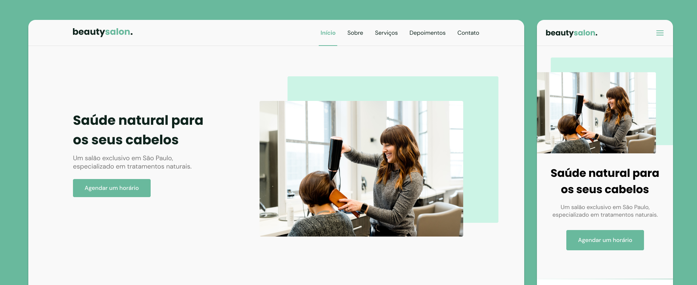

<h1 align="center"> ⌨️ beautysalon. </h1>

	

## 💻 Sobre o projeto

O próposito desse estudo era criar uma **Site Responsivo** utilizando HTML,CSS e JS. Este projeto se enquadra na minha sessão pessoal, onde estou praticando para o meu futuro ingresso no mercado de trabalho.
Beautysalon. é uma página institucional no formato One Page, responsiva. Contém as seguintes seções: Header, Navigation, Home, Sobre, Serviços, Depoimentos, Contato e Footer.

---

## 🛠 Tecnologias e ferramentas utilizadas:

As seguintes ferramentas foram usadas na construção do projeto:

## 🖥️ Demonstração

   

- Você pode acessar o projeto clicando <a href="https://fabricio-roca.github.io/beautysalon.web/">aqui</a>.

---

## 🧠 Créditos

- Agradeço ao Rockyseat pela semana de projeto e a maneira como explicou o conteúdo, consegui configurar o site da maneira que eles haviam explicado e colocando da maneira que eu queria. 

---

### 📝 Bibliotecas

- [Google Fonts](https://fonts.google.com/)
- [SwipeJS](https://github.com/nolimits4web/Swiper)
- [ScrollReveal](https://scrollrevealjs.org)

### 📝 Utilitários

- [randomuser.me](https://randomuser.me/photos)
- [IconMoon](https://icomoon.io/app/#/select)

---

Criado com 💙 por [Fabricio Roca](https://github.com/fabricio-roca)
